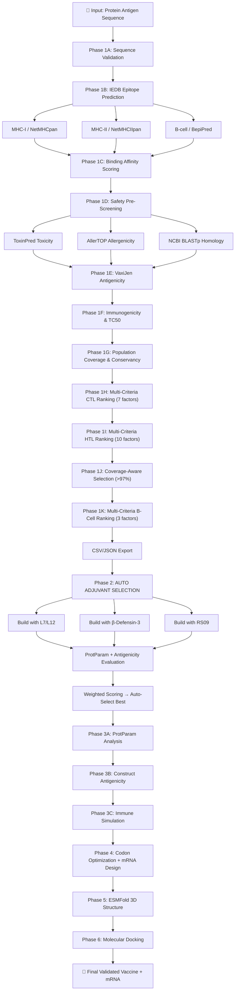

# 🧬 Research-Grade Multi-Epitope Vaccine Design & mRNA Optimization Platform

An end-to-end, research-grade computational platform for the _in silico_ design of multi-epitope subunit vaccines and highly stable mRNA constructs. The pipeline integrates real-world biological constraints, structural thermodynamics, molecular docking, cytokine predictions, automatic adjuvant selection, and immune simulation — all accessible through a unified single-page web dashboard.

---

## 🚀 Research-Grade Highlights

- **Fully Automated Pipeline:** One-click execution from raw protein antigen sequence → validated multi-epitope vaccine construct → optimized mRNA cassette → 3D structure → molecular docking.
- **Automatic Adjuvant Selection:** Evaluates **3 candidate adjuvants** — Ribosomal Protein L7/L12 (TLR4), β-Defensin-3/hBD-3 (TLR1/2), and RS09 (synthetic TLR4) — for every input protein and **auto-selects the optimal adjuvant** using weighted ProtParam scoring.
- **Strict Population Coverage (>97%):** Greedy combinatorial HLA allele selection guaranteeing >97% global population coverage across MHC-I + MHC-II.
- **Advanced 10-Criteria T-Cell Ranking:** Epitopes scored on Binding Affinity, Antigenicity, Allergenicity, Toxicity, Immunogenicity, TC50, Multi-HLA Breadth, IFN-γ, IL-4, and IL-10 induction.
- **Publication-Ready CSV Reports:** Auto-generates normalized multi-criteria epitope tables (`epitope_report_ctl.csv`, `htl.csv`, `bcell.csv`) with per-factor sub-scores.
- **3D Structure & Secondary Structure Analysis:** SOPMA (4-state) & PSIPRED (3-state) secondary structure prediction + report generation (CSV/JSON), coupled with ESMFold 3D structure and Ramachandran validation.
- **mRNA Optimization:** Codon optimization, GC balancing, UTR design, and ΔG thermodynamic stability validation.


---

## 📊 Complete Pipeline Flowchart



---

## 🏗 Vaccine Construct Architecture

The multi-epitope vaccine follows a standardized chimeric architecture:

```
┌─────────┐ ┌─────┐ ┌───────┐ ┌─────┐ ┌───────────────────────┐ ┌──┐ ┌────────────┐ ┌──┐ ┌──────────────┐ ┌──────┐
│ADJUVANT │─│EAAAK│─│ PADRE │─│EAAAK│─│CTL₁-AAY-CTL₂-...-CTLₙ│─│KK│─│HTL₁-GPGPG..│─│KK│─│Bcell₁-KK-... │─│HHHHHH│
│(auto)   │ │rigid│ │T-help │ │rigid│ │  MHC-I epitopes       │ │  │ │ MHC-II epi. │ │  │ │ B-cell epi.  │ │His-tag│
└─────────┘ └─────┘ └───────┘ └─────┘ └───────────────────────┘ └──┘ └────────────┘ └──┘ └──────────────┘ └──────┘
```

| Component | Sequence/Type | Function |
|-----------|--------------|----------|
| **Adjuvant** | Auto-selected from 3 candidates | TLR agonist — activates innate immunity |
| **EAAAK** | Rigid α-helix linker | Prevents inter-domain interference |
| **PADRE** | `AKFVAAWTLKAAA` | Universal CD4+ T-helper epitope |
| **AAY** | CTL linker | Proteasomal cleavage site for MHC-I |
| **GPGPG** | HTL linker | Maintains epitope individuality for MHC-II |
| **KK** | B-cell/group separator | Flexible dibasic linker |
| **HHHHHH** | 6×His tag | Affinity purification (Ni-NTA) |

---

## 🧪 Automatic Adjuvant Selection System

For every input protein, the pipeline evaluates **3 adjuvants** and auto-selects the best one:

| Adjuvant | Length | TLR Target | Mechanism |
|----------|--------|------------|-----------|
| **50S Ribosomal Protein L7/L12** | 130 aa | TLR4 | Strong Th1 response, proven in TB vaccines (M. tuberculosis) |
| **β-Defensin-3 (hBD-3)** | 45 aa | TLR1/2 | Chemoattractant for DCs, bridges innate-adaptive immunity |
| **RS09** | 7 aa | TLR4 | Minimal synthetic TLR4 agonist, compact, low noise |

### Selection Formula

Each adjuvant-construct pair is scored using normalized weighted criteria:

```
Composite Score = 0.35 × Antigenicity_norm + 0.25 × Solubility_norm + 0.25 × Stability_norm + 0.15 × Length_norm
```

| Factor | Weight | Metric | Optimal Value |
|--------|--------|--------|---------------|
| **Antigenicity** | 35% | VaxiJen ACC score | > 0.32 (virus threshold) |
| **Solubility** | 25% | GRAVY (Kyte-Doolittle) | Negative (hydrophilic) |
| **Instability Index** | 25% | Guruprasad dipeptide | < 40 (stable protein) |
| **Construct Length** | 15% | Amino acid count | 200–400 aa optimal |

> The best adjuvant **varies per input protein** depending on the epitope profile.

---

## 🔬 Mathematical Models & Formulas

### 1. Binding Affinity Scoring

```
Score = log(50000 / IC₅₀) + Tier_Bonus + Breadth_Bonus
```

| Parameter | Value | Meaning |
|-----------|-------|---------|
| IC₅₀ normalizer | 50,000 nM | Reference for log-scaling |
| Strong bonus | +5.0 | IC₅₀ < 50 nM |
| Moderate bonus | +2.0 | IC₅₀ < 500 nM |
| Breadth bonus | `1.0 × log(1 + allele_count)` | Multi-HLA reward |

### 2. VaxiJen-like Antigenicity (ACC Transform)

```
Score = 0.35 × hydrophobic_frac + 0.15 × polar_frac + 0.20 × (1 - charged_frac) + 0.30 × min(1, acc_var × 2.0)
```

- Uses Auto Cross-Covariance (ACC) transformation on z1-z3 physicochemical descriptors
- Lag = 7 residues
- Threshold: **0.32** for viruses (Doytchinova & Flower, 2007)

### 3. Immunogenicity (Calis et al. 2013)

Position-weighted amino acid scoring for 9-mer peptides:

| Position | Weight | Role |
|----------|--------|------|
| P1 | 0.04 | Minor TCR contact |
| P2 | 0.00 | MHC anchor (not TCR-facing) |
| P3 | 0.10 | Secondary contact |
| **P4–P6** | **0.25** | **Major TCR contact (central bulge)** |
| P7 | 0.10 | Secondary contact |
| P8 | 0.01 | Near anchor |
| P9 | 0.00 | MHC anchor |

Large aromatic residues (F, W, Y) at TCR-contact positions receive a **+0.08 bonus**.

### 4. TC50 Estimation (Sette & Vitiello 2006)

```
TC50 = IC₅₀ × (1 + e^(-2.0 × immunogenicity_score))
```

| TC50 Range | Classification |
|------------|---------------|
| < 50 nM | **STRONG** activator |
| < 200 nM | MODERATE activator |
| < 500 nM | WEAK activator |
| ≥ 500 nM | POOR activator |

### 5. ProtParam Physicochemical Analysis

| Property | Formula | Reference |
|----------|---------|-----------|
| **Molecular Weight** | `Σ(AA_MW) - 18.02 × (n-1)` | Gasteiger et al. (2005) |
| **Theoretical pI** | Henderson-Hasselbalch binary search (200 iterations) | ExPASy ProtParam |
| **Instability Index** | `(10/n) × Σ(DIWV[dipeptide])` < 40 = stable | Guruprasad et al. (1990) |
| **Aliphatic Index** | `X(Ala) + 2.9×X(Val) + 3.9×(X(Ile)+X(Leu))` | Ikai (1980) |
| **GRAVY** | `mean(Kyte-Doolittle scores)` | Kyte & Doolittle (1982) |
| **Ext. Coefficient** | `nTyr×1490 + nTrp×5500 + nCys×125` | Gill & von Hippel (1989) |
| **Half-life** | N-end rule (first amino acid) | Varshavsky (1996) |

### 6. Population Coverage

```
Combined_Coverage = 1 - Π(1 - freq_i) for all covered HLA alleles
```

Uses HLA frequencies from the Allele Frequency Net Database (AFND) across 17 MHC-I + 10 MHC-II alleles covering >97% global population.

### 7. Allergenicity (AllerTOP-inspired)

Multi-rule confidence scoring:

| Rule | Confidence | Source |
|------|-----------|--------|
| WHO/FAO 8-mer exact match | 0.95 | Codex Alimentarius |
| Known allergen motif match | 0.75–0.95 | SDAP, AllergenOnline |
| Cysteine scaffold (≥2C in ≤20aa) | 0.75 | LTP/defensin patterns |
| Proline-rich repeat (>25%) | 0.70 | Storage proteins |
| Repetitive k-mers (≥3 repeats) | 0.65 | Cross-reactivity risk |
| Basic pI > 10.5 | 0.55 | IgE cross-reactivity |
| GI-stable long peptide | 0.50 | Astwood et al. (1996) |

Cutoff: **confidence ≥ 0.65 → flagged as ALLERGEN**

### 8. Cytokine Prediction

| Cytokine | Method | Positive AA | Negative AA |
|----------|--------|-------------|-------------|
| **IFN-γ** (Th1) | IFNepitope API / AA composition | F, I, L, M, V, W, Y | D, E, K, R, H |
| **IL-4** (Th2) | IL4pred API / AA composition | A, C, G, I, L, M, F, P, W, Y | D, E, R, K, H |
| **IL-10** (Treg) | Polar vs hydrophobic heuristic | Polar fraction − 0.5 × hydrophobic fraction |

### 9. Immune Simulation Heuristic

```
IgM = 0.3×CTL_frac + 0.4×HTL_frac + 0.5×Bcell_frac
IgG = 0.7×CTL_frac + 0.6×HTL_frac + 0.4×Bcell_frac
CD8 = 1.2×MHC-I_frac + 0.2×MHC-II_frac
CD4 = 1.5×MHC-II_frac + 0.2×MHC-I_frac
Memory = 1.0×MHC-II_frac + 1.5×Bcell_frac
```

Classification thresholds: HIGH > 0.6, MODERATE > 0.3, LOW ≤ 0.3

### 10. Molecular Docking Energy Estimation

```
ΔG_estimated = -0.05 × (ligand_atoms + receptor_atoms)^0.7
```

| Receptor | PDB ID | Significance |
|----------|--------|-------------|
| TLR4 | 4G8A | Innate immune activation (adjuvant binding) |
| TLR2 | 2Z7X | PAMP recognition |
| HLA-A*02:01 | 1DUZ | MHC-I antigen presentation |

---

## 📈 Multi-Criteria Scoring Weights

### CTL (CD8+ / MHC-I) — 7 Criteria

| Criterion | Weight | Normalization |
|-----------|--------|---------------|
| **Antigenicity** | **30%** | Score / VaxiJen threshold |
| Binding Strength | 15% | Score / 20.0 |
| Immunogenicity | 15% | (score + 1) / 2 |
| TC50 | 10% | 1 − (TC50 / 1000) |
| Multi-HLA Breadth | 10% | allele_count / total_alleles |
| Allergenicity | 10% | Binary pass/fail |
| Toxicity | 10% | Binary pass/fail |

### HTL (CD4+ / MHC-II) — 10 Criteria

| Criterion | Weight | Normalization |
|-----------|--------|---------------|
| Binding Strength | 15% | Score / 20.0 |
| IFN-γ Induction | 12% | (score + 0.5) / 1.0 |
| Immunogenicity | 12% | (score + 1) / 2 |
| Antigenicity | 10% | Score / threshold |
| IL-4 Induction | 10% | (score + 0.5) / 1.0 |
| Multi-HLA Breadth | 10% | Fraction of total alleles |
| Allergenicity | 8% | Binary |
| Toxicity | 8% | Binary |
| IL-10 Induction | 8% | (score + 0.5) / 1.0 |
| TC50 | 7% | 1 − (TC50 / 1000) |

### B-Cell — 3 Criteria

| Criterion | Weight |
|-----------|--------|
| **Antigenicity** | **50%** |
| Allergenicity | 25% |
| Toxicity | 25% |

---

## 📂 Project Architecture

```text
.
├── app.py                              # Unified FastAPI server (entry point)
├── module1/                            # Biological Analytics & Pipeline
│   ├── main.py                         # Global orchestrator (auto adjuvant selection)
│   ├── adjuvant_selector.py            # Evaluates L7/L12, β-Defensin-3, RS09 per input
│   ├── vaccine_construct_evaluator.py  # Standalone adjuvant comparison runner
│   ├── module1_api.py                  # FastAPI server (dashboard & endpoints)
│   ├── index.html                      # Unified single-page pipeline UI (60KB)
│   ├── default_config.py              # Single source of truth — all constants
│   ├── processing.py                   # Sequence validation & IEDB API calls
│   ├── scoring.py                      # IC50/percentile binding affinity scoring
│   ├── antigenicity.py                 # VaxiJen-like ACC antigenicity prediction
│   ├── allergenicity.py                # AllerTOP-inspired rule-based screening
│   ├── immunogenicity.py               # Calis et al. position-weighted scoring + TC50
│   ├── advanced_filters.py             # ToxinPred toxicity prediction
│   ├── homology.py                     # NCBI BLASTp human proteome homology
│   ├── cytokine.py                     # IFN-γ, IL-4, IL-10 prediction
│   ├── fusion.py                       # Construct assembly (linkers, PADRE, His-tag)
│   ├── protparam.py                    # ProtParam physicochemical analysis
│   ├── epitope_report.py               # Publication-ready CSV/JSON export
│   ├── immune_export.py                # C-ImmSim submission + immune heuristics
│   ├── iedb_advanced.py                # Population coverage & conservancy
│   ├── filter.py                       # Redundancy filtering (overlap detection)
│   ├── structure_3d.py                 # ESMFold API → PDB + pLDDT + DSSP
│   ├── ramachandran.py                 # Ramachandran plot validation
│   ├── docking.py                      # HDOCK/PatchDock docking + energy estimation
│   ├── expression_vector.py            # In silico cloning & vector design
│   └── output/                         # Generated reports, CSVs, PDBs, FASTA
└── module2/                            # mRNA Optimization & Folding Backend
    ├── structure_api.py                # FastAPI backend for RNAfold / MFE
    ├── js/app.js                       # Codon optimization logic
    └── js/config.js                    # Codon usage tables & thresholds
```

---

## 🔌 API Endpoints

| Method | Endpoint | Description |
|--------|----------|-------------|
| `POST` | `/api/run` | Run Module 1 only (epitope prediction → vaccine construct) |
| `POST` | `/api/run-full` | Full pipeline (Module 1 → Module 2 mRNA optimization) |
| `GET` | `/api/epitope-report` | Download latest epitope report (JSON) |
| `GET` | `/api/epitope-csv/{type}` | Download CSV (`ctl`, `htl`, `bcell`, `all`) |
| `POST` | `/api/structure` | ESMFold 3D structure prediction |
| `GET` | `/api/pdb` | Download generated PDB file |
| `POST` | `/api/cytokines` | IFN-γ / IL-4 / IL-10 cytokine prediction |
| `POST` | `/api/docking` | Molecular docking vs TLR4/TLR2/HLA |
| `POST` | `/api/vector` | Expression vector design & in silico cloning |
| `POST` | `/api/secondary-structure` | SOPMA & PSIPRED secondary structure analysis |
| `GET` | `/api/secondary-structure-csv` | Download per-residue secondary structure CSV report |

---


## ⚙️ How to Run

### Step 1: Install Dependencies

```bash
pip install -r requirements.txt
```

### Step 2: Start the Unified Server

```bash
python app.py
```

*Runs on `http://localhost:8080`*

### Step 3: Launch the Dashboard

Open your browser → **http://localhost:8080**

1. Enter your target antigen protein sequence.
2. Click **"Run Full Pipeline"** — the system automatically:
   - Predicts MHC-I, MHC-II, and B-cell epitopes via IEDB
   - Ranks them using multi-criteria weighted scoring
   - Selects the best adjuvant from L7/L12, β-Defensin-3, RS09
   - Builds the final vaccine construct
   - Runs ProtParam, antigenicity, immune simulation
   - Optimizes mRNA, predicts 3D structure, runs docking

---

## 🔬 Pipeline Phases (Detailed)

### Phase 1: Epitope Prediction & Multi-Criteria Selection

1. **Sequence Validation** — Validates input amino acid sequence (min 20 aa)
2. **IEDB API Prediction** — NetMHCpan (MHC-I, 9-mer), NetMHCIIpan (MHC-II, 15-mer), BepiPred (B-cell linear)
3. **Binding Affinity Scoring** — IC50 log-scaling with tier bonuses and allele breadth
4. **Safety Pre-Screening** — ToxinPred toxicity, AllerTOP allergenicity, BLASTp human homology
5. **VaxiJen Antigenicity** — ACC transform on z-descriptors (lag=7)
6. **Immunogenicity & TC50** — Position-weighted scoring (Calis 2013) + Sette-Vitiello TC50
7. **Population Coverage** — HLA frequency-based combinatorial coverage (AFND)
8. **Multi-Criteria Ranking** — CTL (7 criteria), HTL (10 criteria), B-cell (3 criteria)
9. **Coverage-Aware Selection** — Greedy addition until ≥97% combined population coverage
10. **CSV/JSON Export** — Publication-ready epitope reports with normalized sub-scores

### Phase 2: Automatic Adjuvant Selection & Vaccine Assembly

- Builds 3 parallel vaccine constructs with different adjuvants
- Runs full ProtParam + VaxiJen antigenicity on each
- **Weighted composite scoring** (Antigenicity 35%, Solubility 25%, Instability 25%, Length 15%)
- Auto-selects the winner — **result varies per input protein**
- Assembles: `[Adjuvant]-EAAAK-[PADRE]-EAAAK-[CTL epitopes]-KK-[HTL epitopes]-KK-[B-cell epitopes]-HHHHHH`

### Phase 3: Physicochemical Validation & Immune Simulation

- **ProtParam Analysis** — MW, pI, instability index, aliphatic index, GRAVY, extinction coefficient, half-life
- **Full-Construct Antigenicity** — VaxiJen scoring on the complete chimeric protein
- **Immune Simulation** — Heuristic IgM/IgG/CD8/CD4/Memory predictions + C-ImmSim submission guide

### Phase 4: mRNA / CDS Optimization (Module 2)

- Reverse translation using human codon usage tables
- GC balancing (target 52%), forbidden motif removal
- 5' UTR (human β-globin), 3' UTR (double globin), 120-nt poly(A) tail
- CAI validation (> 0.75), m1Ψ nucleotide modification
- ΔG thermodynamic stability via RNAfold or deterministic MFE heuristic

### Phase 5: 3D Structure Prediction

- **ESMFold** (Meta AI) — REST API submission for tertiary structure
- Per-residue **pLDDT** confidence scoring (B-factor column)
- Secondary structure analysis (α-helix, β-sheet, coil percentages)
- **Ramachandran plot** validation for φ/ψ backbone angles
- Downloadable `.pdb` file

### Phase 6: Molecular Docking

- Auto-downloads receptor PDBs from **RCSB** (TLR4:4G8A, TLR2:2Z7X, HLA:1DUZ)
- Attempts programmatic **HDOCK** submission
- Fallback: local energy estimation + one-click links for **HDOCK**, **ClusPro**, **PatchDock**
- Binding energy classification: Strong (<-200), Moderate (-100 to -200), Weak (-50 to -100)

---

## 🛠 Technology Stack

| Layer | Technology |
|-------|-----------|
| **Backend** | Python 3.x, FastAPI, Uvicorn, Pandas, Requests |
| **Frontend** | HTML5, CSS3, Vanilla JavaScript (ES6+) |
| **Bio APIs** | IEDB (NetMHCpan, BepiPred), ESMFold, IFNepitope, IL4pred |
| **Databases** | RCSB PDB, NCBI BLASTp, Allele Frequency Net Database |
| **Docking** | HDOCK, ClusPro, PatchDock |
| **Simulation** | C-ImmSim (external), RNAfold / ViennaRNA |

---

## 📚 Key References

| Reference | Used For |
|-----------|----------|
| Doytchinova & Flower (2007) — VaxiJen | Antigenicity prediction (ACC method) |
| Calis et al. (2013) — PLoS Comp Bio | Immunogenicity position-weighted scoring |
| Sette & Vitiello (2006) | TC50 estimation from IC50 |
| Guruprasad et al. (1990) | Instability index (dipeptide weights) |
| Gasteiger et al. (2005) — ExPASy | ProtParam physicochemical analysis |
| Kyte & Doolittle (1982) | GRAVY hydropathicity scale |
| Dhanda et al. — IFNepitope | IFN-γ induction prediction |
| Singh et al. (2017) — IL4pred | IL-4 induction prediction |
| Martinelli (2022), Mortazavi (2024), Shabbir (2025) | Multi-epitope vaccine design methodology |

---

## 📜 License

*Research-Grade Development v5.0 — Optimized for Automated in silico Multi-Epitope Vaccine Design with Automatic Adjuvant Selection.*